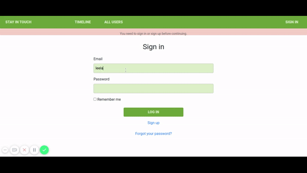

##  Social Media Website

We built a social media app called “Stay in touch”. In this project, we add the following features:

A guest user:

* Is able to create account/log in.
* Can see only “Sign in” and “Sign out” page.

A logged-in user:

* Is able to see all users list.
* Is able to see selected user page with their user name and all posts written by them (the most recent posts on the top).
* Is able to send a friendship invitation.
* Is able to see a button “Invite to friendship” next to the name of user who is not my friend yet - on both users’ list and single user page.
* Is able to see pending friendship invitations sent to me from other users.
* Is able to accept or reject friendships invitation.
* Is able to create new posts (text only).
* Is able to like/dislike posts (but I can like single post only once).
* Is able to add comments to posts.
* Is able to see “Timeline” page with posts (with number of likes and comments) written by me and all my friends (the most recent posts on the top).
* Timeline page should be the root page of the app.

## Demo

### Usage

* This project intends to practice our skills working with Associations and Database;
* Prepare data architecture documentation;
* Work with GitFlow principles. 
* Work with deployment to Heroku.

### Build With

- Ruby 2.7.0p0
- Ruby on Rails 5.2.4.4
- Heroku

### Setup
 - Open a terminal
 - Copy this code : 
 
        
        git clone https://github.com/sanadwj/ror-social-scaffold

        bundle install
       
        rails db:migrate

        access http://localhost:3000

        - Open a terminal
 
 - To check RSpecs : 
 
        bundle exec rspec

        
## Author

👤 **Carlos Veiga**

- Github: [@wrakc](https://github.com/wrakc)
- Twitter: [@carlosveig](https://twitter.com/carlosveig)
- Linkedin: [chveiga](https://linkedin.com/chveiga)

👤 **Sanad Walid Abujbara**

- Github: [@sanadwj](https://github.com/githubhandle)
- Twitter: [@sandooog](https://twitter.com/sandooog)
- Linkedin: [sanad-abujbara](https://linkedin.com/in/sanad-abujbara)

## 🤝 Contributing

Contributions, issues and feature requests are welcome!

## Show your support .

Give a ⭐️ if you like this project!

## Acknowledgments

- Microverse Team 124 (The Minskins)
- Microverse Team 139 (The Thanatos)

## 📝 License

This project is [MIT](LICENSE) licensed.
